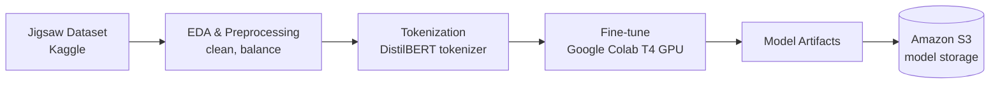
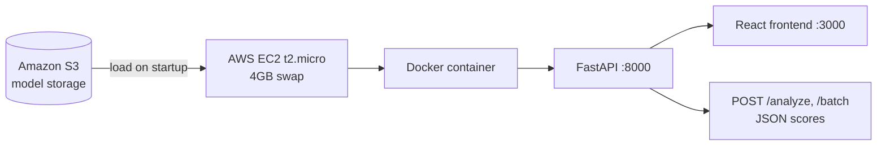
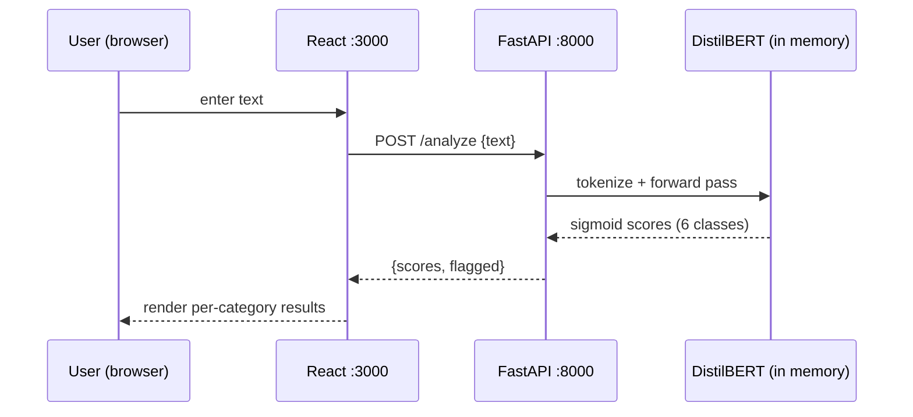
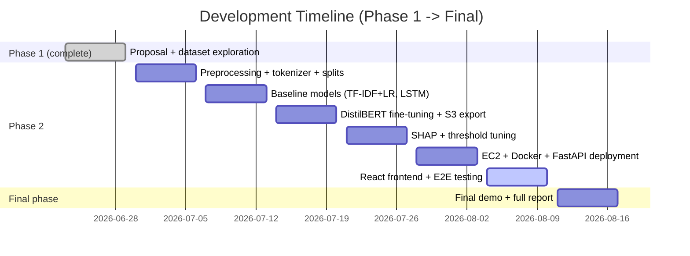

# Project Plan — Hate Speech and Toxicity Detection Using DistilBERT

**A Multi-Label Classification System**

| | |
|---|---|
| **Course** | PROG74040 — Advanced Topics in Artificial Intelligence and Machine Learning |
| **Institution** | Conestoga College |
| **Team** | Jerin Pious, Evan Tomy (Group 2) |
| **Phase 1 Instructor** | Akrem El-ghazal *(confirm instructor of record for Phase II — the Phase II guidelines document lists Peiyuan Zhou)* |
| **Current Phase** | Phase II — Progress Report, Code, Presentation |
| **Plan Last Updated** | 2026-08-09 |

Related: [REQUIREMENTS.md](REQUIREMENTS.md) — functional/non-functional requirements and the grading-alignment checklist.

---

## 1. Project Overview

We are building a multi-label toxicity classifier that scores a piece of text against six categories simultaneously — `toxic`, `severe_toxic`, `obscene`, `threat`, `insult`, `identity_hate` — and exposes it as a live REST API. The core model is **DistilBERT**, fine-tuned with a sigmoid multi-label head, chosen specifically because it fits the memory/cost envelope of a free-tier AWS deployment while retaining ~97% of full BERT's language understanding.

This plan governs execution from the end of Phase I through Phase II submission and hand-off into the final phase. It is a living document — update the status markers as work lands, don't let it drift out of sync with reality.

## 2. Problem Statement (carried from Phase 1)

- **Problem**: Manual content moderation cannot keep pace with the volume of user-generated text online. Keyword blocklists miss coded, context-dependent hostility; classical ML (TF-IDF + logistic regression, naive Bayes) treats language as a bag of tokens and misses meaning carried by word order and context.
- **Why advanced ML**: A fine-tuned transformer can recognize hostile intent in phrasing that contains no blocklisted words (e.g., "go back to where you came from").
- **Business/social impact**: Regulatory pressure (EU Digital Services Act, Canada's proposed Online Harms Act) and the operational case for pre-screening content so human moderators focus on ambiguous cases rather than clear violations.
- **Multi-label framing**: A comment can be simultaneously obscene *and* threatening, so the output layer uses independent sigmoid probabilities per class (via `BCEWithLogitsLoss`), not softmax.

## 3. Phase II Objectives

Directly from `Course Project Guidelines Phase II.pdf`, Phase II must demonstrate:

1. Progress since Phase I, with an updated system architecture describing how the system is *actually* being built (not just planned).
2. A working baseline model and a working advanced (fine-tuned) model, with preliminary evaluation results for both.
3. Deployment progress — hosting platform and how the end user interacts with it.
4. Clear team contribution breakdown.

**Definition of done for this phase**: baseline model trained and scored, DistilBERT fine-tuned and scored, both results compared side by side, something deployed and reachable at a URL, and the report/code/deck submitted in the required format. See [REQUIREMENTS.md §9](REQUIREMENTS.md#9-grading-alignment-matrix) for the exact grading mapping.

## 4. Dataset Summary

| Property | Value |
|---|---|
| Source | Jigsaw Toxic Comment Classification Challenge (Kaggle / Conversation AI, 2018) |
| Size | ~159,571 training comments, ~153,164 test comments, Wikipedia talk pages |
| Labels | 6 binary, non-exclusive: `toxic`, `severe_toxic`, `obscene`, `threat`, `insult`, `identity_hate` |
| Class balance | ~90% non-toxic; toxic 9.6%, obscene 5.3%, insult 4.9%, severe_toxic 1.0%, identity_hate 0.9%, threat 0.3% |
| License | CC0 — unrestricted use/modification/redistribution |
| Local status | ✅ Present — `train.csv/`, `test.csv/`, `test_labels.csv/` confirmed in working directory, schema matches the proposal |

Note: `test_labels.csv` has `-1` placeholders for rows Kaggle withheld from public scoring — these rows must be filtered out of any test-set evaluation, not treated as a seventh label value.

## 5. System Architecture

### 5.1 Training pipeline (offline)

### 5.2 Deployment pipeline (online)

### 5.3 Request flow

### 5.4 Component inventory

| Layer | Technology | Status |
|---|---|---|
| Training environment | Google Colab (free T4 GPU) | ❓ verify |
| Model | `distilbert-base-uncased` fine-tuned, sigmoid head | ❓ verify |
| Baselines | TF-IDF + Logistic Regression; LSTM + GloVe-100d | ❓ verify |
| Explainability | SHAP / Integrated Gradients | ❓ verify |
| Model storage | Amazon S3 (free tier, 5 GB) | ❓ verify |
| Hosting | AWS EC2 t2.micro (free tier) + 4GB swap on EBS | ❓ verify |
| Containerization | Docker | ❓ verify |
| Backend | FastAPI | ❓ verify |
| Frontend | React | ❓ verify |
| Version control | GitHub (private repo, feature-branch workflow) | ❓ verify — no repo visible from this local folder |

Status column reflects only what is verifiable from this local working directory as of 2026-08-09 — it is **not** a claim that this work hasn't happened elsewhere (Colab, a teammate's machine, a GitHub repo not cloned here). Replace ❓ with ✅/⬜ as each item is confirmed.

## 6. Development Roadmap

This is the original Phase 1 timeline carried forward, with today's position marked. Confirm the actual Phase II due date with the instructor — it is not stated in the guideline documents — and adjust dates if it lands outside this window.

| Week | Dates | Milestone | Owner | Status (as of 2026-08-09) |
|---|---|---|---|---|
| 7 | Jun 23–29 | Phase 1 proposal + presentation submitted; GitHub repo initialized; dataset downloaded/explored | All | ✅ Proposal/deck exist; ❓ repo unconfirmed; ✅ dataset present |
| 8 | Jun 30–Jul 6 | Preprocessing pipeline complete; tokenizer integrated; train/val/test splits finalized | Jerin / Evan | ❓ verify |
| 9 | Jul 7–13 | Baseline models trained (TF-IDF+LR, LSTM); initial F1/ROC-AUC recorded | Jerin | ❓ verify |
| 10 | Jul 14–20 | DistilBERT fine-tuning complete; hyperparameter sweep; weights exported to S3 | Jerin | ❓ verify |
| 11 | Jul 21–27 | SHAP explainability; sigmoid threshold optimization; final model locked | Jerin | ❓ verify |
| 12 | Jul 28–Aug 3 | EC2 provisioned; Docker container built/deployed; FastAPI endpoints verified end-to-end | Evan | ❓ verify |
| **13** | **Aug 4–10** | **React frontend integrated; end-to-end flow tested; performance benchmarks documented** | **All** | **◀ current week** |
| 14 | Aug 11–17 | Final demo delivered; full project report submitted | All | ⬜ upcoming |

**Immediate priority**: given weeks 8–12 are all unconfirmed from this folder, the first real task is a status sync with Jerin — find out what actually exists in Colab/GitHub before assuming any of weeks 8–12 are behind schedule.

## 7. Team Workflow

| Area | Approach |
|---|---|
| Version control | GitHub, private repo, feature-branch workflow, PRs require one peer review before merge |
| Task management | GitHub Projects (Kanban): To Do → In Progress → Review/QA → Done; weekly sprint planning each lab session |
| Sync communication | Weekly in-person meetings during lab sessions |
| Async communication | WhatsApp group for daily updates and quick decisions |

### Responsibilities

| Member | Owns |
|---|---|
| Jerin Pious | Model architecture, Colab fine-tuning, evaluation, SHAP explainability, experiment tracking |
| Evan Tomy | Data preprocessing pipeline, EC2 provisioning, Docker, FastAPI backend, React frontend |

Phase II report must restate this with specifics — actual PRs opened, actual hours, actual blockers — not just the role assignment above (see rubric §"Team Workflow and Contribution").

## 8. Risk Register

| Risk | Likelihood | Impact | Mitigation |
|---|---|---|---|
| EC2 t2.micro (1GB RAM) OOM under DistilBERT + FastAPI + Docker overhead | Medium | High — deployment is worth 4% (rubric) / 3pts (eval table) | 4GB swap already planned; load-test with concurrent requests before demo day; have a fallback (Hugging Face Spaces or Streamlit) documented as a backup even though the proposal deprioritized it |
| Class imbalance (90% non-toxic) collapses model to majority-class predictions | Medium | High — tanks F1/ROC-AUC targets | Class-weighted loss + stratified splits already planned; verify per-class recall specifically for `threat` (0.3% of data) since it's the sparsest label |
| Colab session timeout mid-training loses progress | Medium | Medium | Checkpoint model + optimizer state every epoch to Drive/S3, not just at the end |
| Two-person team, single points of failure per role | Medium | High | Cross-train briefly on the other's component before deployment week so either person can debug EC2 or the model pipeline |
| Report/code/deck naming convention mismatch across the two grading documents | Low | Low (but easy to lose free points on) | Resolved in [REQUIREMENTS.md §8](REQUIREMENTS.md#8-documentation--submission-requirements) — submit both an `.ipynb` and a repo link to satisfy both documents |
| Phase II due date not stated in any local document | Medium | High | Confirm with instructor immediately; don't assume week 13/14 from the Phase 1 timeline is authoritative |

## 9. Deliverables Checklist (summary)

Full item-by-item grading alignment lives in [REQUIREMENTS.md §9](REQUIREMENTS.md#9-grading-alignment-matrix). At a glance, Phase II requires:

- [ ] Written report, ≤10 pages — `Group-2-Phase-2-Report-Jerin-Evan.pdf`
- [ ] Code submission — `Group-2-Phase-2-code-Jerin-Evan.ipynb` **and/or** GitHub repo + README + link
- [ ] Presentation, 15 minutes — `Group-2-Phase-2-Presentation-Jerin-Evan.pptx`
- [ ] Working baseline model with recorded metrics
- [ ] Working fine-tuned DistilBERT with recorded metrics
- [ ] Baseline vs. advanced model comparison (explicitly graded — 3/16 points on the evaluation table)
- [ ] Deployed, reachable model demo (explicitly graded — 3/16 points, and its own rubric row)
- [ ] Individual contribution clearly presentable by both team members (4% of grade is individual, not group)

## 10. Beyond Phase II — Looking Ahead to Final Delivery

Not graded now, but worth keeping in view so Phase II choices don't create rework:

- Multi-task learning (shared encoder, six task-specific heads) was floated in Phase 1 as something to *explore* — decide at the Phase II retro whether it's worth the added complexity or whether the single multi-label head is good enough to ship.
- SHAP/Integrated Gradients explainability was scoped for "auditability" — make sure it produces something demo-able (e.g., a token-highlighted output in the frontend), not just a notebook cell, since "Technical Depth and Innovation" is explicitly graded.
- Final phase will want a polished demo narrative — start capturing screenshots/short clips of the working system now rather than reconstructing them under deadline pressure later.
